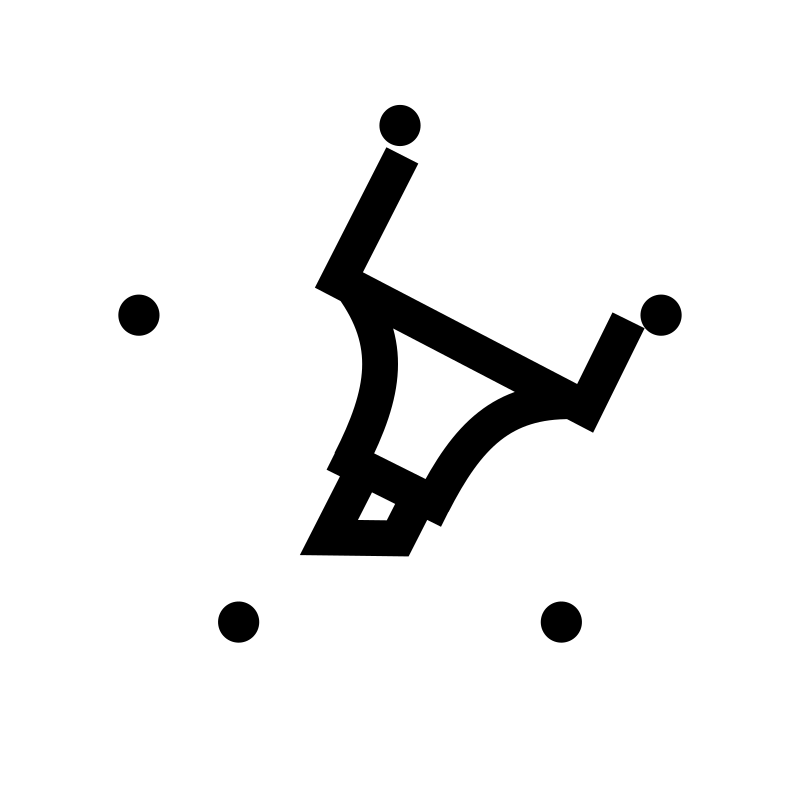

<h1 align="center">Marker</h1>
<p align="center">
    
</p>

<br/>

[](https://crates.io/crates/marker_api)
[](#license)

Marker is an experimental code analysis interface, with the goal to create a stable and user-friendly linting framework for the Rust programming language. Creating custom lints should be a straightforward process, and using them should be as simple as declaring a new dependency.

Let's make custom lints and code analysis a reality!

> **Note**
>
> The project is in the early stages of development, some things are still missing and the API is still unstable.
>
> A collection of features, goals and current limitations is available below.

## Features

* **Custom Lints**: Marker offers a framework for everyone to create and provide custom lints, allowing you to automatically improve the code quality for you and users of your crate.
* **User-Friendly Interface**: Marker provides a new subcommand for [Cargo] that does all the heavy lifting for you. [cargo_marker] can automatically set up a driver for linting, compile lint crates and run them on any project.
* **Driver Independent**: Every code analysis requires a driver that parses the code and provides further information. Marker's API is designed to be driver-independent, allowing it to support future compilers and potentially IDEs. (Currently, [rustc] is the only available driver).
* **CI ready**: Marker provides pre-compiled binaries, installation scripts, and a GitHub Action to make CI usage easy.

And more to come, see Marker's goals and limitations below.

[cargo_marker]: https://crates.io/crates/cargo_marker
[rustc]: https://github.com/rust-lang/rust/
[Cargo]: https://github.com/rust-lang/cargo

## Usage

The following is an abbreviated guide. Check out [The Marker Book] for detailed instructions and additional information.

[The Marker Book]: https://rust-marker.github.io/marker/book

### Installation

#### Download pre-compiled binaries (recommended)

<!-- Please keep this section in sync with the docs/book/src/usage/installation.md -->

We provide pre-compiled binaries for the mainstream platforms. See the list of available artifacts in our [Github Releases](https://github.com/rust-marker/marker/releases/latest).

Select one of the installation scripts below according to your platform. The script will install the required Rust toolchain dependency on your machine, download the current version of `cargo-marker` CLI, and the internal driver.

<!-- region replace marker version stable -->

**Linux or MacOS (Bash)**:
```bash
curl -fsSL https://raw.githubusercontent.com/rust-marker/marker/v0.3/scripts/release/install.sh | bash
```

**Windows (PowerShell)**:
```ps1
curl.exe -fsSL https://raw.githubusercontent.com/rust-marker/marker/v0.3/scripts/release/install.ps1 | powershell -command -
```

The provided scripts use a sliding git tag `v0.3`, to allow for automatic patch version updates, however a fixed tag `v0.3.0` is also available.

<!-- endregion replace marker version stable -->

If you are on a platform that isn't supported yet by the pre-compiled binaries, then you should fall back to building from sources as described below.

#### Build from sources

```sh
cargo install cargo_marker

# Automatically setup the toolchain and build driver from sources
cargo marker setup --auto-install-toolchain
```

### CI usage

Marker provides a Github Action that downloads the pre-compiled binaries and runs `cargo marker`.

<!-- region replace marker version stable -->

```yml
- uses: rust-marker/marker@v0.3
```

If you want to only install Marker, and not run it, there is an option for that.

```yml
- uses: rust-marker/marker@v0.3
  with:
    install-only: true

# `cargo marker` command should be available at this point
- run: cargo marker --version
```

See [The Marker Book] for more details and examples of workflows.

<!-- endregion replace marker version stable -->

### Specifying lints

Marker requires lint crates to be specified. The best way is to add them to the `Cargo.toml` file, like this:

<!-- region replace marker version stable -->
```toml
[workspace.metadata.marker.lints]
# A local crate as a path
marker_lints = { path = './marker_lints' }
# An external crate via git
marker_lints = { git = "https://github.com/rust-marker/marker" }
# An external crate from a registry
marker_lints = "0.3.0"
```
<!-- endregion replace marker version stable -->

### Making Your Own Lints

You can create your own lint crates if you want, the [lint-crate-template] has all the basics for you to get started writing your own lints.

[lint-crate-template]: https://github.com/rust-marker/lint-crate-template

### Running Marker

Running Marker is as simple as running its sibling *[Clippy]*. Navigate to your Rust project directory and run the following command:

```sh
cargo marker
```

This will initialize Marker, compile the lint crates and start linting.

[Clippy]: https://github.com/rust-lang/rust-clippy

## Goals

* **Stability**: Marker's API design focuses on stability and extendability. The goal is to archive backwards compatibility, so that any lint, written after version 1.0.0, will compile and continue to work for years to come.
* **Usability**: Marker's API focuses on usability, where possible under the constraints of Marker's stability guarantees. Types follow common design patterns and naming conventions, allowing you to focus on the lint logic directly.
* **Be A Foundation**: Marker wants to be a foundation for new tools which make linting even easier, provide deeper code analysis capabilities and allow for automated migrations.

<!-- FIXME(xFrednet): Update the link to link to `crates.io` once the first version was released-->
[marker_api]: https://github.com/rust-marker/marker/tree/master/marker_api

## Limitations

Marker is still growing up, and that's a good thing. We can still shape the API and adapt it to what the user needs. However, this and the fact that Marker is not an official Rust project comes with some limitations:

* **Nightly**: Internally, Marker has to rely on nightly versions of rustc. However, you, as an end-user, should not notice this dependency.
* **AST Limitations**: Marker's API is still missing a few elements to represent everything required for linting. The API is still incomplete when it comes to:
    * Higher order types
    * Attributes [#51](https://github.com/rust-marker/marker/issues/51)
    * Macros [rust-marker/design#47](https://github.com/rust-marker/design/issues/47)
    * Item visibility [#26](https://github.com/rust-marker/marker/issues/26)
* **Utility**: The API is currently lacking a lot of utility functions, to handle edge cases and make linting more pleasant.
* **Documentation**: Marker still requires a lot of documentation, in the form of doc comments and a book, which explains the basic concept and works as a guide for end-users, lint- and marker-devs alike.

[crates.io]: https://crates.io/

## Development Timeline

1. Improve documentation and conduct user tests.
2. Update and expand the API to incorporate feedback.
3. Work on the AST Limitations mentioned above.
4. Create more example lints.

The used nightly version will be updated every 6 weeks, when a new version of Rust is released.

## Contributing

Contributions are highly appreciated! If you encounter any issues or have suggestions for improvements, please don't hesitate to [open an issue]. If you have an idea for a lint you want to implement with Marker, please share it by creating a [user story].

Still reading? Interested in helping out? Wonderful! Check out Marker's [contributor documentation]

[open an issue]: https://github.com/rust-marker/marker/issues/new
[user story]: https://github.com/rust-marker/design/issues/new?template=user-story.md
[contributor documentation]: ./CONTRIBUTING.md

## License

Copyright (c) 2022-2023 Rust-Marker

Rust-marker is distributed under the terms of the MIT license or the Apache License (Version 2.0).

See [LICENSE-APACHE](https://github.com/rust-marker/marker/blob/master/LICENSE-APACHE), [LICENSE-MIT](https://github.com/rust-marker/marker/blob/master/LICENSE-MIT).

### Credit

Marker is inspired and contains code snippets from [rustc], [Clippy] and [the Rust Reference]. These projects are dual-licensed under the Apache 2.0 and MIT licenses. See [`./COPYRIGHT.md`](./COPYRIGHT.md)

[rustc]: https://github.com/rust-lang/rust
[Clippy]: https://github.com/rust-lang/rust-clippy
[the Rust Reference]: https://github.com/rust-lang/reference/
