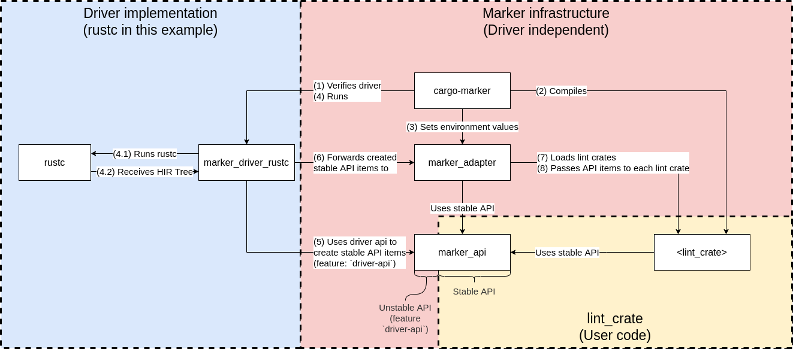

# Internal documentation

This documentation covers the internal structure of marker.
Everything here is no part of the stable API and might change completely in the future.

## Structure

This linter consists out of several crates, each with one specific job.
The background color in the image indicates what a crate belongs to:

* The yellow area is the stable API used by *lint_crates*.
Additionally, it's expected, that the command interface of `cargo-marker` will remain constant.
* The red area is unstable and contains all driver independent crates and infrastructure.
* The blue area is driver-specific.
It'll use crates from the red area to create a stable AST representation and providing it to lint crates.

The jobs and stability guarantees are documented in the crate specific `README.md` files.
This document will go over the step by step linting process for a lint pass.

1. `cargo-marker` starts off by verifying that a driver is available
    (In dev mode it will compile the driver for every run)
2. `cargo-marker` compiles all defined lint crates
    and moves the binaries to a single target directory (currently `target/marker/lints`)
3. `cargo-marker` sets environment values required by `marker_adapter`
4. `cargo-marker` starts the driver.
    Currently, for rustc, this is done by setting `RUSTC_WORKSPACE_WRAPPER`
    and then executing `cargo check` which will in turn execute the driver like it was the usual rustc binary.
    1. `lint_driver_rustc` internally runs rustc with the given arguments.
    2. `rustc` Parses the source code and starts its analysis.
        During this analysis, a lint pass from `lint_driver_rustc` will be called,
        which gives us access to the HIR tree and context objects.
5. The driver uses the `driver-api` feature to construct stable API items from the `marker_api` crate.
6. The driver then forwards these stable API items to `marker_adapter`
7. `marker_adapter` loads all lint crates from the environment value set by `cargo-marker`
8. `marker_adapter` then traverses the given AST tree
    and passes all objects to the respective lint pass functions implemented by the lint crates.
9. *lint_crates* receive an `MarkerContext` object with each lint pass function.
    With this context, they can request nodes by ID or emit lint messages like in rustc's lint passes.
